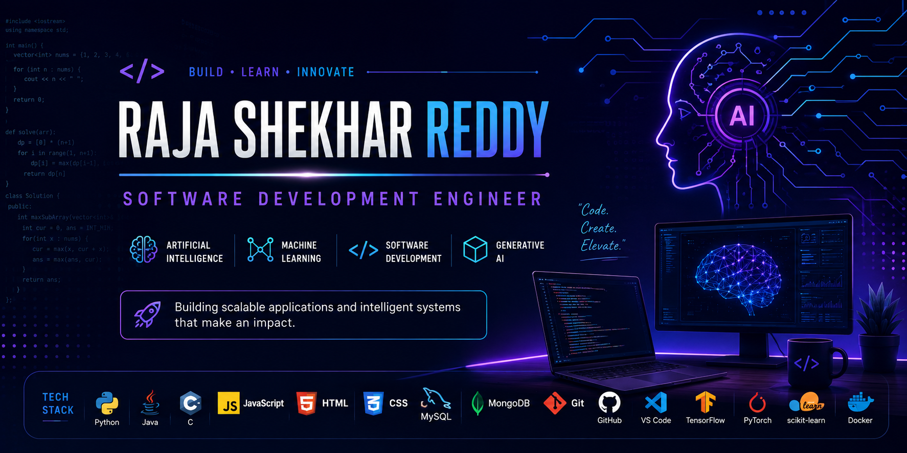

  

# Hi 👋, I'm Raja Shekhar Reddy

---

# 💫 About Me

🎓 Engineering Student passionate about Software Development and Artificial Intelligence.

💻 I enjoy building scalable software, solving DSA problems, and creating AI-powered applications.

🤖 Interested in

- Artificial Intelligence
- Machine Learning
- Generative AI
- NLP
- Backend Development
- Full Stack Development

🌱 Currently Learning

- System Design
- Agentic AI
- Cloud Technologies
- Advanced DSA

🚀 Goal

Become a Software Development Engineer while building impactful AI applications.

---

# 💻 Tech Stack

### Languages

### Frameworks & Libraries

### Database

### Tools

---

# 📊 GitHub Stats

---

# 🏆 GitHub Trophies

---

# 🚀 Featured Projects

⭐ Machine Translation using Transformers

⭐ Lead Scoring using Machine Learning

⭐ House Price Prediction

⭐ Dish Delight Recipe Website

⭐ AI & NLP Projects

⭐ Full Stack Applications

---

# 📈 Contribution Graph

---

# 🌐 Connect With Me

<!-- Add LinkedIn later -->

---

### ⭐ Thanks for visiting my profile!

